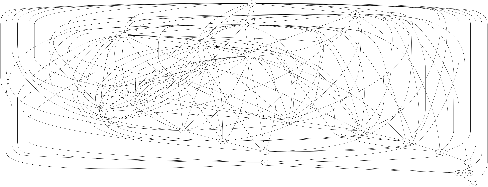

# Triangle-Distinct Graphs Construction
*Jan Miksa*

This simplistic implementation of method described in below paper allows for constructing triangle-distinct graphs of given size and checking whether given graph is traingle distinct.  
[Triangle-degree and triangle-distinct graphs](https://www.sciencedirect.com/science/article/pii/S0012365X23003813?via%3Dihub)

*Examples in `test.py`*

## Constructed G24
